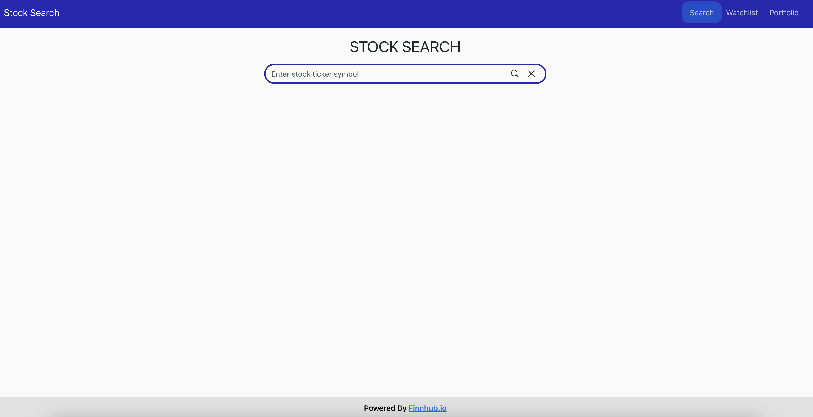
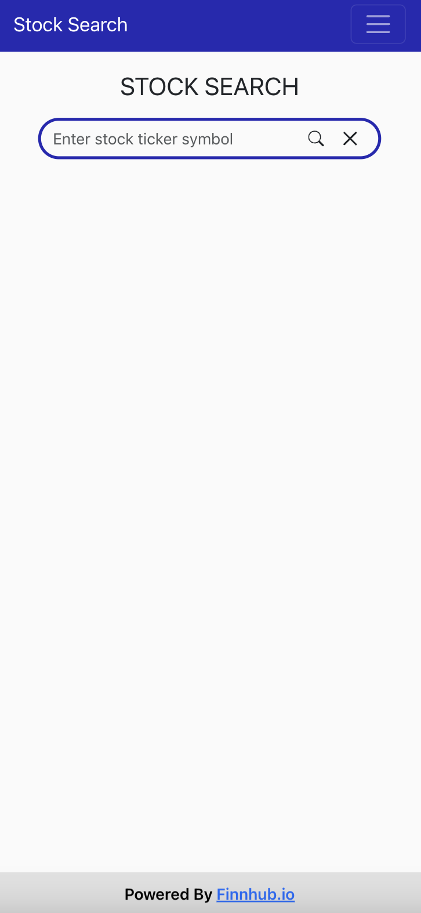
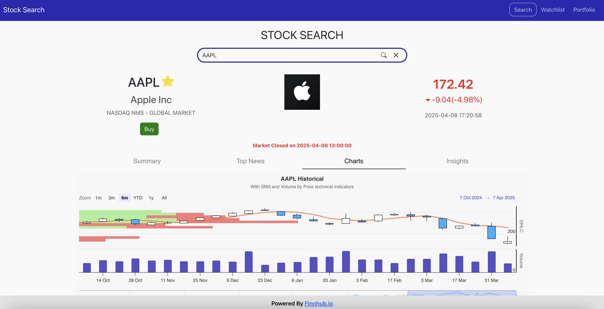
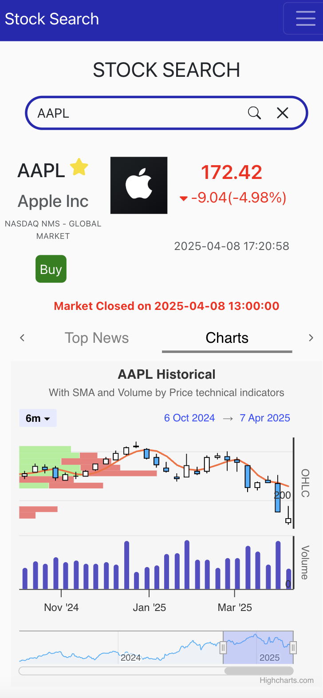

# Stock Trader Portal

A full-stack stock trading dashboard built with **React.js**, **Node.js**, and **MongoDB Atlas**. The app allows users to search for stock information, visualize real-time data, manage a personal watchlist and portfolio, and simulate buy/sell transactions — all deployed on cloud infrastructure.

> ⚠️ **Note**: Due to academic integrity policies, this repository only contains partial implementation and did not provide the live demo. Sensitive logic and API keys are excluded. Please contact the author for further information (excluding currently enrolled students).


---

## 🎥 Demo

[]()

---

## 🖼️ Feature Preview (Desktop vs Mobile)

### 🔍 Search Page

| Desktop | Mobile |
|--------|--------|
|  |  |

---

### 📊 Chart View

| Desktop | Mobile |
|--------|--------|
|  |  |

---

### 📰 News Section

| Desktop | Mobile |
|--------|--------|
|  |  |

---

### 💼 Portfolio Tab

| Desktop | Mobile |
|--------|--------|
|  |  |

---

### ⭐ Watchlist

| Desktop | Mobile |
|--------|--------|
|  | 


---

## Tech Stack

- **Frontend**: React.js, Bootstrap 5, Highcharts, Axios
- **Backend**: Node.js, Express.js, Envalid (env validation), dotenv
- **Database**: MongoDB Atlas
- **Cloud**: Google Cloud / AWS
- **APIs**:
  - [Finnhub](https://finnhub.io/) – Stock data, news, and insights
  - [Polygon.io](https://polygon.io/) – Historical and volume data
- **Security**:
  - API keys stored securely in `.env`
  - Server-side proxy prevents client-side leaks
---

## Features

- **Real-time stock search** with autocomplete suggestions
- **Stock Details Page**:
  - Real-time price, percent change, market status
  - Auto-refresh every 15 seconds when market is open
- **Charts Tab**:
  - Interactive Highcharts with volume & SMA trends
- **News Tab**:
  - Latest headlines from Finnhub with Twitter/Facebook share support
- **Portfolio Tab**:
  - Simulated trading with buy/sell modals and wallet balance
- **Watchlist Tab**:
  - Persistent storage via MongoDB Atlas
- **Responsive Design**: Fully mobile-ready with Bootstrap

---

## 📁 Folder Structure

```text
stock-trader-portal/
├── frontend/             # React app
│   ├── public/
│   └── src/
│       ├── components/   # Reusable React components
│       └── App.js        # Main React entry point
│
├── backend/              # Node.js + Express backend
│   ├── src/
│   ├── .env              # Environment variables (not committed)
│   └── server.ts         # Server entry file
│
├── .env.example          # Sample env file for setup
├── .gitignore
├── README.md
└── package.json

```

---

## How to use:


### 1. Clone the Repo

```bash
git clone https://github.com/choyerhuang/stock-trader-portal.git
cd stock-trader-portal
```
### 2. Install Dependencies

```bash
# Frontend
cd frontend
npm install

# Backend
cd ../backend
npm install
```

### 3. Configure Environment

Create a .env file in /backend using the structure below:

```env
MONGO_CONNECTION_STRING=your_mongo_uri
PORT=8080
SESSION_SECRET=your_secret_here
FINNHUB_KEY=your_finnhub_api_key
POLYGON_KEY=your_polygon_api_key
```

### 4. Run the App
```bash
# Start backend
cd backend
npm run build
npm start

# Start frontend (in a separate terminal)
cd frontend
npm start
```
---

##  Academic Integrity Notice
This project was developed as part of a university course assignment.
Only partial code is shared to prevent plagiarism and uphold academic policies.
If you'd like to learn more about the project architecture or approach, please contact:
ihanghua@usc.edu

---

## License
This repository is for educational and demonstration purposes only.
Reproduction or reuse of code without permission is prohibited.